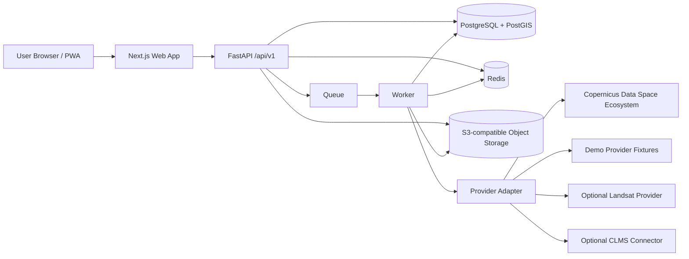

# Architecture Diagram

```mermaid
flowchart LR
  U[User Browser / PWA] --> W[Next.js Web App]
  W --> API[FastAPI /api/v1]
  API --> PG[(PostgreSQL + PostGIS)]
  API --> R[(Redis)]
  API --> S3[(S3-compatible Object Storage)]
  API --> Q[Queue]
  Q --> WK[Worker]
  WK --> R
  WK --> PG
  WK --> S3
  WK --> PA[Provider Adapter]
  PA --> CDSE[Copernicus Data Space Ecosystem]
  PA --> DEMO[Demo Provider Fixtures]
  PA --> LANDSAT[Optional Landsat Provider]
  PA --> CLMS[Optional CLMS Connector]
```
