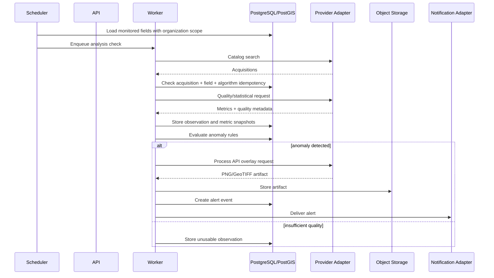

# Satellite Analysis Data Flow

```mermaid
sequenceDiagram
  participant Scheduler
  participant API
  participant Worker
  participant DB as PostgreSQL/PostGIS
  participant Provider as Provider Adapter
  participant Storage as Object Storage
  participant Notify as Notification Adapter

  Scheduler->>DB: Load monitored fields with organization scope
  Scheduler->>Worker: Enqueue analysis check
  Worker->>Provider: Catalog search
  Provider-->>Worker: Acquisitions
  Worker->>DB: Check acquisition + field + algorithm idempotency
  Worker->>Provider: Quality/statistical request
  Provider-->>Worker: Metrics + quality metadata
  Worker->>DB: Store observation and metric snapshots
  Worker->>DB: Evaluate anomaly rules
  alt anomaly detected
    Worker->>Provider: Process API overlay request
    Provider-->>Worker: PNG/GeoTIFF artifact
    Worker->>Storage: Store artifact
    Worker->>DB: Create alert event
    Worker->>Notify: Deliver alert
  else insufficient quality
    Worker->>DB: Store unusable observation
  end
```
