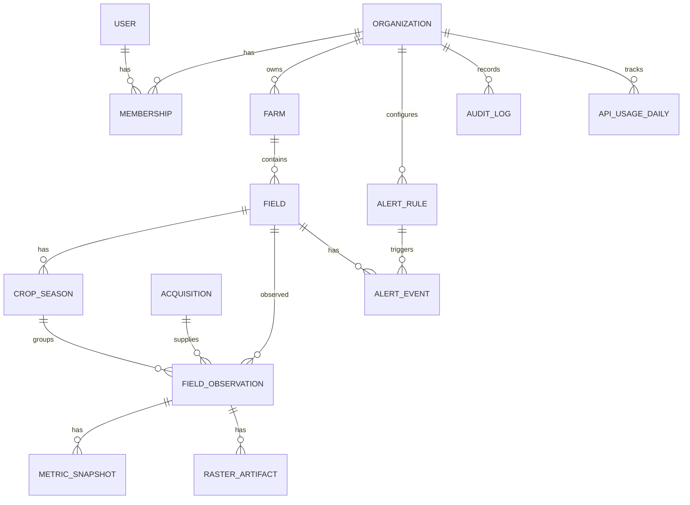

# ER Diagram

```mermaid
erDiagram
  USER ||--o{ MEMBERSHIP : has
  ORGANIZATION ||--o{ MEMBERSHIP : has
  ORGANIZATION ||--o{ FARM : owns
  FARM ||--o{ FIELD : contains
  FIELD ||--o{ CROP_SEASON : has
  FIELD ||--o{ FIELD_OBSERVATION : observed
  CROP_SEASON ||--o{ FIELD_OBSERVATION : groups
  ACQUISITION ||--o{ FIELD_OBSERVATION : supplies
  FIELD_OBSERVATION ||--o{ METRIC_SNAPSHOT : has
  FIELD_OBSERVATION ||--o{ RASTER_ARTIFACT : has
  ORGANIZATION ||--o{ ALERT_RULE : configures
  ALERT_RULE ||--o{ ALERT_EVENT : triggers
  FIELD ||--o{ ALERT_EVENT : has
  ORGANIZATION ||--o{ AUDIT_LOG : records
  ORGANIZATION ||--o{ API_USAGE_DAILY : tracks
```
